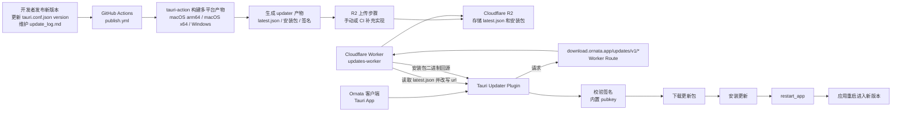

<!-- 发布时间: 2026-03-24T20:59:44+08:00 -->


很多“桌面应用自动更新”教程只演示了这一句：

```ts
const update = await check();
```

但真正能跑起来的自动更新，远不止一个前端 API。

你至少要同时打通这 6 件事：

1. 构建出 updater 能识别的安装包或更新包。
2. 用私钥对更新包签名，并把公钥内置到客户端。
3. 让固定的更新地址返回合法的 `latest.json`。
4. 让 `latest.json` 里指向的安装包真的能下载。
5. 让客户端完成 `check -> download -> install -> restart`。
6. 让版本发布流程把上面这些产物稳定地发布出去。

本文以 Ornata 这个 Tauri 2 项目为例，完整拆开它的自动更新实现。读完之后，你应该能给自己的桌面软件搭一套同样可用的自动更新链路。

本文讨论的是 Tauri 2 的桌面端自动更新，不包含 iOS / Android。

## 先给结论：Ornata 的自动更新架构长什么样

Ornata 的实现可以概括成一句话：

> Tauri 负责签名校验和安装，前端负责更新 UI 与下载进度，GitHub Actions 负责构建发布，Cloudflare Worker + R2 负责分发 `latest.json` 和安装包。

具体拆开是这样：

1. `src-tauri/tauri.conf.json` 开启 `createUpdaterArtifacts`，配置公钥和更新地址。
2. `src-tauri/src/lib.rs` 注册 `tauri-plugin-updater`，并暴露一个 `restart_app` 命令给前端调用。
3. `src/App.tsx` 用 `@tauri-apps/plugin-updater` 完成检查更新、下载、安装、重启，以及更新面板 UI。
4. `.github/workflows/publish.yml` 在 macOS / Windows 上构建更新产物，使用私钥签名，并把 release notes 写进 release body。
5. `cloudflare/updates-worker/src/index.ts` 从 R2 读取 `latest.json` 和安装包，请求 `latest.json` 时动态改写其中的下载 URL。

如果你想对照仓库读源码，优先看这 5 个文件：

1. `src-tauri/tauri.conf.json`
2. `src-tauri/src/lib.rs`
3. `src/App.tsx`
4. `cloudflare/updates-worker/src/index.ts`
5. `.github/workflows/publish.yml`

如果你只记住一件事，那就是：

> 自动更新的核心不是“检查更新”，而是“让客户端拿到一份签名正确、URL 正确、平台正确、可访问的更新描述文件”。




---


## 一、Tauri 侧的基础配置

### 1. 开启 updater 产物生成

Ornata 的关键配置如下：

```json
{
  "bundle": {
    "active": true,
    "targets": ["app", "dmg", "msi", "nsis"],
    "createUpdaterArtifacts": true
  },
  "plugins": {
    "updater": {
      "pubkey": "YOUR_PUBLIC_KEY_CONTENT",
      "endpoints": [
        "https://download.example.com/updates/v1/{{target}}/{{arch}}/latest.json"
      ],
      "windows": {
        "installMode": "passive"
      }
    }
  }
}
```

这里 4 个字段最关键：

1. `createUpdaterArtifacts: true`
   Tauri 在构建时会额外生成 updater 使用的更新包和签名。
2. `pubkey`
   这里必须是公钥内容本身，不是文件路径。
3. `endpoints`
   客户端会把 `{{target}}`、`{{arch}}` 替换成当前平台信息，然后去请求更新描述。
4. `windows.installMode: "passive"`
   Windows 安装更新时显示一个轻量进度窗口，不要求用户一路点下一步。

Tauri 官方文档明确要求 updater 必须校验签名，而且这个校验不能关闭。所以，签名不是可选增强，而是自动更新的前提条件。

### 2. 注册 updater 插件

Rust 侧初始化非常简单：

```rust
.plugin(tauri_plugin_updater::Builder::new().build())
```

对应到自己的项目，你至少要做到两件事：

1. 在 `Cargo.toml` 里加入 `tauri-plugin-updater = "2"`。
2. 在 `lib.rs` 或 `main.rs` 里初始化这个插件。

如果插件没注册，前端 `check()` 会直接不可用。

### 3. 开 updater 权限

Ornata 的 capability 里显式加了：

```json
"updater:default"
```

Tauri 2 的权限模型比较严格。你要是只装了插件，但没给窗口能力，前端照样调不起来。

### 4. 准备签名密钥

Tauri 官方推荐用 CLI 生成 updater 签名密钥：

```bash
bunx tauri signer generate -w ~/.tauri/myapp.key
```

然后你会得到：

1. 私钥：只用于 CI 或发布机签名，绝对不能下发给客户端。
2. 公钥：写进 `tauri.conf.json` 的 `plugins.updater.pubkey`。

构建时要把私钥放进环境变量：

```bash
export TAURI_SIGNING_PRIVATE_KEY="Path or content of your private key"
export TAURI_SIGNING_PRIVATE_KEY_PASSWORD=""
```

注意一点：官方文档特别说明，这两个变量不能依赖 `.env` 自动生效；构建进程必须真的拿到它们。

---

## 二、Ornata 的客户端更新流程

很多人会把自动更新写成“一次性函数”。Ornata 没这么做，它把整个过程拆成了两个阶段：

1. `checkForAppUpdates`
2. `installAppUpdate`

这个拆法比 `downloadAndInstall()` 更适合做有 UI 的桌面软件，因为你可以先拿到版本号、发布日期、更新说明，再决定要不要安装。

### 1. 检查更新：只拿元数据和下载句柄

Ornata 的逻辑本质上是这样的：

```ts
import { check, type Update } from "@tauri-apps/plugin-updater";

let pendingUpdate: Update | null = null;

async function checkForAppUpdates() {
  if (pendingUpdate) {
    await pendingUpdate.close();
    pendingUpdate = null;
  }

  const update = await check({ timeout: 30000 });
  if (!update) {
    return null;
  }

  pendingUpdate = update;
  return {
    version: update.version,
    notes: update.body ?? "",
  };
}
```

这里有两个容易被忽略的细节。

第一，`check()` 返回的不是普通 JSON，而是一个 `Update` 资源对象。它不仅包含版本信息，还持有之后 `download()` / `install()` 所需的句柄。

第二，旧的 `Update` 对象要记得 `close()`。Ornata 在重新检查更新前和安装结束后都会清理这个资源，这样不会把过期句柄留在内存里。


### 2. 下载与安装：自己处理进度，比黑盒更好用

Ornata 没直接调用 `downloadAndInstall()`，而是拆开成：

```ts
await update.download((event) => {
  switch (event.event) {
    case "Started":
      break;
    case "Progress":
      break;
    case "Finished":
      break;
  }
}, { timeout: 10 * 60 * 1000 });

await update.install();
```

这么做的好处是：

1. 你能自己画下载进度条。
2. 你能自己做状态提示，比如“检查中”“下载中”“安装中”。
3. 下载超时时间和检查超时时间可以分开控制。

Ornata 的进度计算方式也很实用：

1. `Started` 事件里拿 `contentLength`。
2. `Progress` 事件里累加 `chunkLength`。
3. 前端自己算百分比。

这套逻辑不依赖额外后端接口，完全靠 updater 插件事件就能完成。

### 3. 安装完成后主动重启

安装结束后，Ornata 会调用自定义命令：

```ts
await invoke("restart_app");
```

Rust 侧实现很直接：

```rust
#[tauri::command]
fn restart_app(app: tauri::AppHandle) {
    app.restart();
}
```

为什么不用额外的 process 插件，而是自己包一个命令？

原因很简单：需求只有“安装后重启应用”这一件事，自定义命令更轻，也更容易和现有的 Tauri command 体系保持一致。

如果你的项目已经用了 `@tauri-apps/plugin-process`，当然也可以直接 `relaunch()`。但如果你只需要重启，像 Ornata 这样写一个命令就够了。

### 4. 更新说明怎么进入 UI

Ornata 的更新说明不是本地写死的，而是直接读取 updater 返回的 `body`：

```ts
const notes = (update.body ?? "").trim() || "—";
```

然后再交给 Rust 侧的 Markdown 渲染命令转成 HTML，最后显示在更新面板里。

这意味着：

1. 你的 release notes 可以跟着发布流程走。
2. 客户端不需要再单独请求“版本说明接口”。
3. 自动更新和版本公告天然是同一份数据。

这也是为什么 Ornata 的 `publish.yml` 会先从 `docs/update_log.md` 里抽取当前版本文案，再把它写进 GitHub Release body。

---

## 三、更新服务端到底要提供什么

Tauri 官方支持两种模式：

1. 动态更新服务
2. 静态 `latest.json`

Ornata 采用的是中间路线：

> 客户端看见的是静态 `latest.json`，但这个 `latest.json` 是由 Cloudflare Worker 从 R2 里读出来后再动态改写的。

这套方案的好处是：

1. 客户端协议足够简单，只认一个固定 URL。
2. 存储层可以完全静态化，适合 CDN 缓存。
3. 你可以随时在 Worker 层做 URL 改写、灰度、缓存控制，而不用改客户端。

> 配图建议 2
> 这里适合放 Cloudflare 的资源关系图。
> 建议内容：自定义域名 `download.example.com` 命中 Worker Route，Worker 绑定 R2 Bucket，`latest.json` 和安装包都存放在 R2 中。

### 1. `latest.json` 必须满足什么格式

如果你走静态 JSON，至少要满足这个结构：

```json
{
  "version": "0.1.8",
  "notes": "Bug fixes and improvements",
  "pub_date": "2026-03-24T12:00:00Z",
  "platforms": {
    "darwin-aarch64": {
      "signature": "SIGNATURE_CONTENT",
      "url": "https://download.example.com/updates/v1/darwin/aarch64/0.1.8/MyApp.app.tar.gz"
    },
    "windows-x86_64": {
      "signature": "SIGNATURE_CONTENT",
      "url": "https://download.example.com/updates/v1/windows/x86_64/0.1.8/MyApp-setup.exe"
    }
  }
}
```

最重要的两条约束：

1. `signature` 必须是 `.sig` 文件里的内容本身，不是 `.sig` 文件的 URL。
2. `url` 必须指向真正可下载的更新包。

很多人第一次做 updater 会卡在第一条。因为直觉上很容易把 `.sig` 文件一起上传，然后在 JSON 里写个地址，但 Tauri 不认这个用法。

> 配图建议 3
> 这里适合放一张 `latest.json` 示例截图。
> 建议重点标出 3 个字段：`version`、`platforms.*.signature`、`platforms.*.url`。

### 2. Ornata 的 Worker 做了什么

Ornata 的 Worker 主要做 3 件事：

1. 限定只处理 `/updates/v1/*` 下面的请求。
2. 如果请求的是 `latest.json`，先读取 JSON，再把里面的下载地址改写成自己的域名。
3. 如果请求的是安装包，直接从 R2 回源，同时补 `Content-Type` 和缓存头。

简化后大概是这样：

```ts
if (path.endsWith("/latest.json")) {
  const parsed = JSON.parse(text);
  parsed.platforms[key].url =
    `${origin}/updates/v1/${target}/${arch}/${version}/${filename}`;
  return json(parsed, { cacheControl: "public, max-age=60" });
}

return binary(object.body, {
  cacheControl: "public, max-age=31536000, immutable",
});
```

这个设计很聪明，因为它把“更新描述”和“真实下载地址”解耦了。

也就是说：

1. 你可以直接把 CI 生成的 `latest.json` 放进 R2。
2. 你不必在构建阶段提前知道最终 CDN 域名。
3. 你只要能从 `url` 里提取出文件名，就能在边缘层重写下载地址。

> 配图建议 4
> 这里适合放 Worker 代码逻辑截图。
> 建议重点圈出两段：一段是读取 `latest.json` 后重写 `platforms.*.url`，另一段是普通二进制文件直接从 R2 回源。

### 3. 为什么要把 `latest.json` 和安装包分开缓存

Ornata 的缓存策略是：

1. `latest.json`: `max-age=60`
2. 安装包: `max-age=31536000, immutable`

这是非常标准的一种更新分发做法。

原因也很直接：

1. `latest.json` 是“当前最新版指针”，必须允许客户端很快看到新版本。
2. 安装包文件一旦生成，就应该是版本化且不可变的，可以放心长期缓存。

如果你把安装包也做成短缓存，CDN 命中率会很差。
如果你把 `latest.json` 也做成长缓存，客户端就会迟迟看不到新版本。

---

## 四、Ornata 的发布链路还差哪一步

Ornata 的仓库里已经有一个很完整的发布工作流：

1. 从 `src-tauri/tauri.conf.json` 读取版本号。
2. 从 `docs/update_log.md` 抽取当前版本的 release notes。
3. 在 macOS arm64、macOS x86_64、Windows 上构建应用。
4. 使用 `TAURI_SIGNING_PRIVATE_KEY` 和 `TAURI_SIGNING_PRIVATE_KEY_PASSWORD` 对 updater 产物签名。
5. 调用 `tauri-apps/tauri-action` 生成 release draft 和 updater JSON。

但是，离“真正可用的自动更新”还差最后一步：

> 把生成出来的 `latest.json` 和更新包上传到 R2。

这是很多团队都会漏掉的一步。

本地打包成功，不代表自动更新已经完成。
只有当 `https://download.example.com/updates/v1/{{target}}/{{arch}}/latest.json` 真能返回合法 JSON，并且其中的安装包 URL 真能下载时，这套链路才算闭环。

---

## 五、如果你照着做，R2 目录应该怎么设计

如果你复用 Ornata 这套路径约定，我建议你的对象存储至少长这样：

```text
updates/v1/
  darwin/
    aarch64/
      latest.json
      0.1.8/
        MyApp.app.tar.gz
  windows/
    x86_64/
      latest.json
      0.1.8/
        MyApp-setup.exe
```

这里有两个关键点：

1. `latest.json` 始终放在固定路径。
2. 真正的安装包放在带版本号的目录下。

这样做之后：

1. 客户端的 endpoint 永远不用改。
2. CDN 可以把安装包当不可变资源长期缓存。
3. 你可以随时回溯历史版本。

注意：

1. 对于 static JSON 方案，运行时真正必须可访问的通常只有 `latest.json` 和安装包 URL 指向的文件。
2. `.sig` 文件主要用于生成 `latest.json` 里的 `signature` 字段，是否额外对外提供不是必需条件。

> 配图建议 5
> 这里强烈建议放一张 Cloudflare R2 Bucket 的对象列表截图。
> 建议截图内容：
> 1. 左侧是 Bucket 名称。
> 2. 右侧对象列表里能看到 `updates/v1/darwin/aarch64/latest.json` 这类路径。
> 3. 最好同时展示一个带版本号目录，例如 `updates/v1/windows/x86_64/0.1.8/...`。


---

## 六、把缺失的 R2 上传步骤补上

如果你想把 Ornata 这套方案真正自动化，我建议在 CI 里补一个“上传到 R2”的步骤。

Cloudflare 官方文档给了两类方案：

1. `wrangler r2 object put`
2. `rclone copy`

如果你的文件不多，`wrangler r2 object put` 足够了。下面以 Wrangler 4 为例，注意要显式带上 `--remote`：

```bash
APP_VERSION=0.1.8
BUCKET=myapp

npx wrangler r2 object put \
  "$BUCKET/updates/v1/darwin/aarch64/latest.json" \
  --file="./release/darwin-aarch64/latest.json" \
  --remote

npx wrangler r2 object put \
  "$BUCKET/updates/v1/darwin/aarch64/$APP_VERSION/MyApp.app.tar.gz" \
  --file="./release/darwin-aarch64/MyApp.app.tar.gz" \
  --remote

npx wrangler r2 object put \
  "$BUCKET/updates/v1/windows/x86_64/latest.json" \
  --file="./release/windows-x86_64/latest.json" \
  --remote

npx wrangler r2 object put \
  "$BUCKET/updates/v1/windows/x86_64/$APP_VERSION/MyApp-setup.exe" \
  --file="./release/windows-x86_64/MyApp-setup.exe" \
  --remote
```


如果你的产物多、平台多，或者想做目录级同步，Cloudflare 官方更推荐用 `rclone` 或任意 S3 兼容工具。

我的建议是：

1. 第一版先手工上传，确认整个更新链路通了。
2. 第二版再把上传动作并入 CI。

先验证链路，再自动化，排障会轻松很多。

> 配图建议 8
> 这里适合放一张“上传完成后的验证图”。
> 建议内容：浏览器打开 `https://download.example.com/updates/v1/darwin/aarch64/latest.json` 返回 JSON，或者直接展示 R2 + Route + 浏览器访问三者打通后的结果。

## 七、你自己的项目照着做，最小实现步骤是什么

如果你想把这篇文章直接转成任务清单，可以按下面的顺序做。

### 第 1 步：安装并初始化 updater 插件

```bash
bun add @tauri-apps/plugin-updater
```

Rust 侧：

```toml
tauri-plugin-updater = "2"
```

然后在 `lib.rs` 注册插件，并在 capability 里加入 `updater:default`。

### 第 2 步：生成签名密钥

```bash
bunx tauri signer generate -w ~/.tauri/myapp.key
```

把生成的公钥内容写进 `tauri.conf.json` 的 `plugins.updater.pubkey`。

### 第 3 步：配置 `tauri.conf.json`

最少要有：

```json
{
  "bundle": {
    "createUpdaterArtifacts": true
  },
  "plugins": {
    "updater": {
      "pubkey": "YOUR_PUBLIC_KEY",
      "endpoints": [
        "https://download.example.com/updates/v1/{{target}}/{{arch}}/latest.json"
      ]
    }
  }
}
```

### 第 4 步：实现客户端更新逻辑

最小版可以这么写：

```ts
import { check } from "@tauri-apps/plugin-updater";
import { invoke } from "@tauri-apps/api/core";

export async function runUpdateFlow() {
  const update = await check({ timeout: 30000 });
  if (!update) return false;

  await update.download(undefined, { timeout: 10 * 60 * 1000 });
  await update.install();
  await update.close();
  await invoke("restart_app");
  return true;
}
```

但如果你要做正式产品，我更建议像 Ornata 一样把“检查”和“安装”分开，并自己接管下载进度 UI。

### 第 5 步：构建更新产物

构建前注入私钥：

```bash
export TAURI_SIGNING_PRIVATE_KEY="Path or content of your private key"
export TAURI_SIGNING_PRIVATE_KEY_PASSWORD=""
```

然后正常执行：

```bash
bunx tauri build
```

### 第 6 步：生成并发布 `latest.json`

你有两种选法。

1. 直接把 `latest.json` 放到 GitHub Releases / S3 / R2。
2. 像 Ornata 一样，在 Worker 边缘层改写下载 URL。

如果你刚开始做，我建议先选第一种，先把链路跑通。
如果你之后要接 CDN、自定义域名、灰度策略，再上第二种。

> 配图建议 9
> 这里适合放 Cloudflare Worker Route 配置页截图。
> 建议重点展示：
> 1. Route 规则，例如 `download.example.com/updates/v1/*`
> 2. 对应绑定的 Worker
> 3. 如果有自定义域名，最好连域名配置一起展示

### 第 7 步：把产物上传到存储层

无论你用 GitHub Releases、S3 还是 R2，本质要求都一样：

1. `latest.json` 可以被客户端请求到。
2. `latest.json` 中的 `url` 可以下载到正确平台的更新包。
3. `signature` 与这个更新包匹配。

只要这三件事成立，自动更新就能工作。

---

## 八、几个最容易踩的坑

### 1. `signature` 写成 URL

这是最常见的错误。

错误写法：

```json
"signature": "https://example.com/update.sig"
```

正确写法：

```json
"signature": "GENERATED_SIG_CONTENT"
```

### 2. 只生成了安装包，没有生成 updater 产物

如果你没开 `createUpdaterArtifacts: true`，普通安装包可能能构建出来，但 updater 不一定有可用的更新描述和签名链路。

### 3. 忘了上传到最终 endpoint

这是 Ornata 当前仓库里最值得提醒的一点。

GitHub Action 构建成功，不等于自动更新已经能用。
真正决定成败的是：客户端配置里的 endpoint 能不能返回正确内容。

### 4. Windows 同时生成 MSI 和 NSIS，却没想清楚要用谁做 updater

Tauri 在 Windows 上既可以用 MSI，也可以用 NSIS。

如果你两个都生成，就要提前决定：

1. `latest.json` 里到底引用哪一个。
2. 如果以后升级 `tauri-action`，是否要处理带 installer 后缀的平台 key。

官方 `tauri-action` 在较新的版本里，`latest.json` 可能会包含 `{os}-{arch}-{installer}` 这种 key。Ornata 的 Worker 在解析平台 key 时没有写死“必须正好两个片段”，这是正确方向。

如果你也要自己改写 `latest.json`，不要把平台 key 写死成“只允许 `OS-ARCH`”。

### 5. 不重启应用

`install()` 结束不代表当前进程已经自动切到新版本。

无论你用 `app.restart()`、`relaunch()` 还是其他方式，安装完成后的重启动作都要明确设计。

---

## 九、自动更新上线前检查清单

在你给用户放出自动更新之前，至少检查下面这些项：

1. `tauri.conf.json` 已开启 `createUpdaterArtifacts`。
2. 客户端内置的是公钥内容，不是公钥文件路径。
3. CI 构建时确实注入了私钥环境变量。
4. endpoint 使用 HTTPS。
5. `latest.json` 能在浏览器里直接访问。
6. `latest.json` 里的 `version`、`url`、`signature` 都合法。
7. `url` 指向的安装包可以真实下载。
8. Windows 是否明确选择了 MSI 或 NSIS。
9. 客户端安装完成后会重启。
10. 你至少做过一次“旧版本 -> 新版本”的真实升级测试。


## 参考资料

1. Tauri Updater 文档: https://v2.tauri.app/plugin/updater/
2. Tauri JavaScript Updater API: https://v2.tauri.app/reference/javascript/updater/
3. `tauri-apps/tauri-action`: https://github.com/tauri-apps/tauri-action
4. Cloudflare R2 上传对象文档: https://developers.cloudflare.com/r2/objects/upload-objects/
5. Cloudflare Wrangler R2 命令文档: https://developers.cloudflare.com/r2/reference/wrangler-commands/
6. Ornata官网:https://ornata.app
